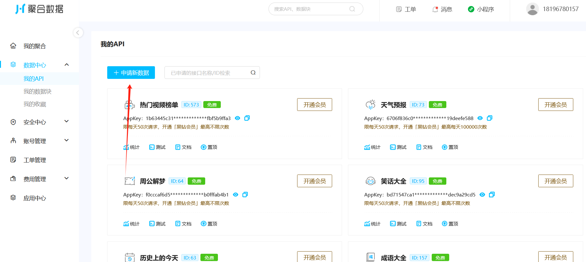
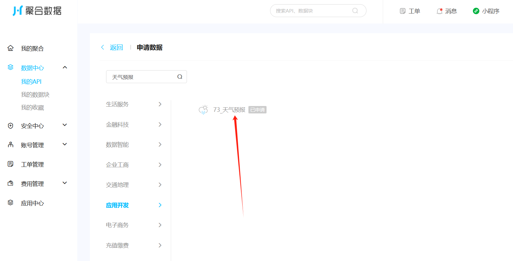
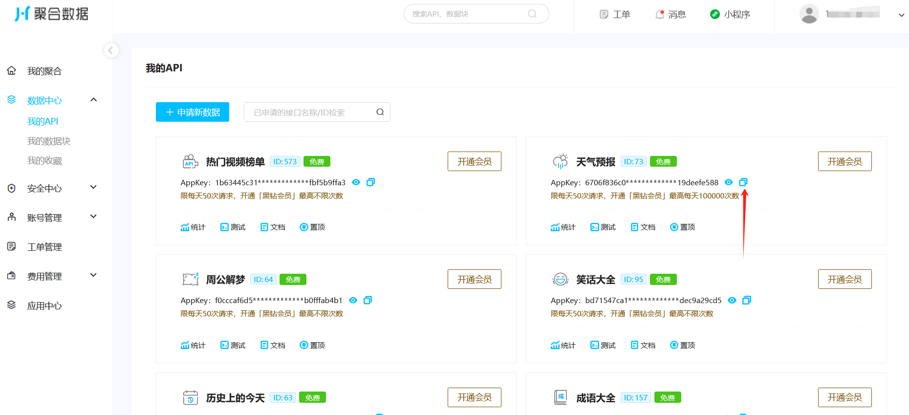
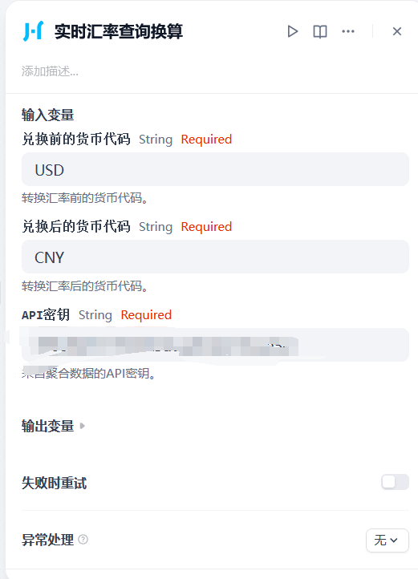

## Juhe Data API Plugin

**Author:** [leslie2046](https://github.com/leslie2046)
**Version:** 0.0.1
**Type:** Tool

### 🔍 Description

Access real-time **weather**, **currency exchange rates**, and **currency code lists** via the Juhe API.

> 📌 *Note: Some currency code queries may return no result depending on data availability.*

---

### ✅ Features

* **Weather** — Get weather info by city
* **Exchange** — Convert between two currencies
* **Currency List** — View common currency codes

---

### 🛠️ Setup

1. Register at [Juhe.cn](https://www.juhe.cn/)
2. Get your API Key:

   * Visit [我的API](https://dashboard.juhe.cn/data/index/my)
   
   * Click "申请新数据" → Select "天气预报"
   
   * Copy the generated API Key
   

---

### 🚀 Example Usage

#### 📍 Weather

```json
{
    "reason": "查询成功!",
    "result": {
        "city": "上海",
        "realtime": {
            "temperature": "23",
            "humidity": "43",
            "info": "多云",
            "wid": "01",
            "direct": "西风",
            "power": "2级",
            "aqi": "45"
        },
        "future": [
            {
                "date": "2025-05-10",
                "temperature": "17\/25℃",
                "weather": "阴",
                "wid": {
                    "day": "02",
                    "night": "02"
                },
                "direct": "西风"
            },
            {
                "date": "2025-05-11",
                "temperature": "17\/26℃",
                "weather": "多云转晴",
                "wid": {
                    "day": "01",
                    "night": "00"
                },
                "direct": "西风转南风"
            },
            {
                "date": "2025-05-12",
                "temperature": "19\/29℃",
                "weather": "晴转阴",
                "wid": {
                    "day": "00",
                    "night": "02"
                },
                "direct": "东南风转南风"
            },
            {
                "date": "2025-05-13",
                "temperature": "20\/29℃",
                "weather": "阴",
                "wid": {
                    "day": "02",
                    "night": "02"
                },
                "direct": "东南风"
            },
            {
                "date": "2025-05-14",
                "temperature": "21\/29℃",
                "weather": "阴转小雨",
                "wid": {
                    "day": "02",
                    "night": "07"
                },
                "direct": "东南风转南风"
            }
        ]
    },
    "error_code": 0
}
```

#### 💱 Exchange Rate

```json
{
    "reason": "查询成功!",
    "result": [
        {
            "currencyF": "USD",
            "currencyF_Name": "美元",
            "currencyT": "CNY",
            "currencyT_Name": "人民币",
            "currencyFD": "1",
            "exchange": "7.2374",
            "result": "7.2374",
            "updateTime": "2025-05-10 15:27:00"
        },
        {
            "currencyF": "CNY",
            "currencyF_Name": "人民币",
            "currencyT": "USD",
            "currencyT_Name": "美元",
            "currencyFD": "1",
            "exchange": "0.1382",
            "result": "0.1382",
            "updateTime": "2025-05-10 15:27:00"
        }
    ],
    "error_code": 0
}
```

#### 💹 Currency List

```json
{
  "reason": "查询成功",
  "result": {
    "list": [
            {
                "name": "美元",
                "code": "USD"
            },
            {
                "name": "人民币",
                "code": "CNY"
            },
            {
                "name": "日元",
                "code": "JPY"
            },
            {
                "name": "欧元",
                "code": "EUR"
            },
      ...
    ]
  },
  "error_code": 0
}
```

---

### 🐞 Issues & Feedback

* [Open an Issue](https://github.com/leslie2046/dify-plugin-juhe/issues)
* Include error messages and steps to reproduce
* ⚠️ Please **don’t** submit plugin issues to the main [Dify](https://github.com/langgenius/dify) repo

---

### 📄 License

[MIT](./LICENSE)

