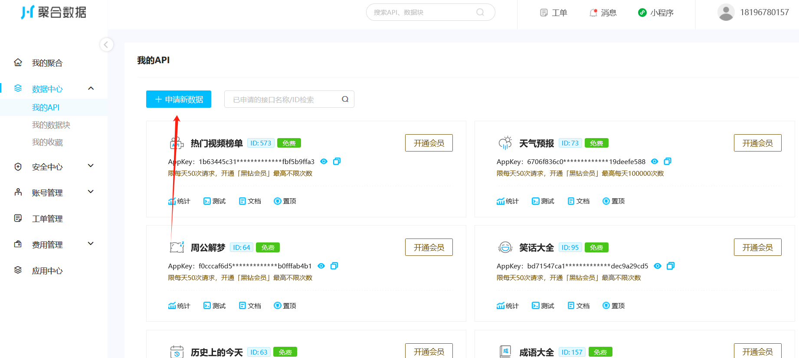
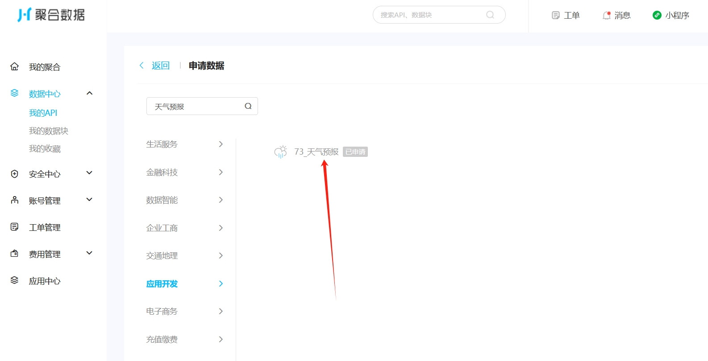
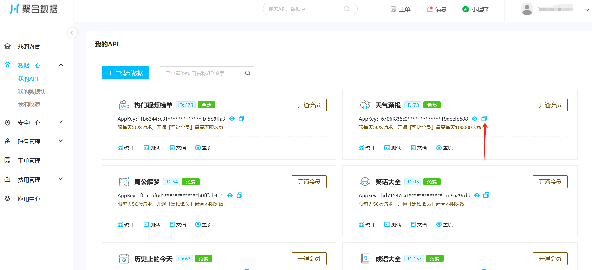
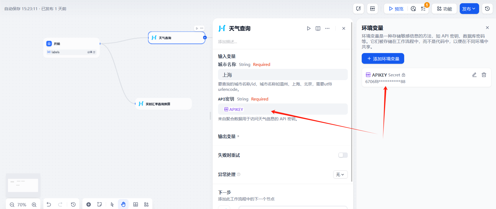
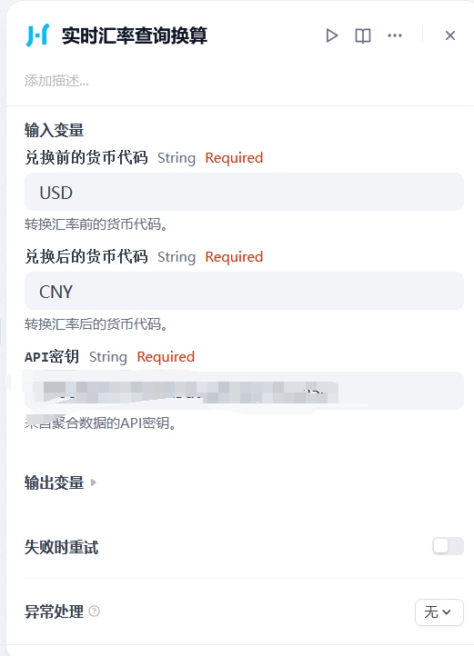

## Juhe Data API Plugin

**Author:** [leslie2046](https://github.com/leslie2046)
**Version:** 0.0.1
**Type:** Tool
**Repo:** [dify-plugin-juhe](https://github.com/leslie2046/dify-plugin-juhe)

### 🔍 Description

Access real-time **weather**, **currency exchange rates**, and **currency code lists** via the Juhe API.

> 📌 *Note: Some currency code queries may return no result depending on data availability.*

---

### ✅ Features

* **Weather** — Get weather info by city
* **Exchange** — Convert between two currencies
* **Currency List** — View common currency codes
* **Oil Price** — Get oil price from china today
* **Stock** — View stock information from USA/HK/Shanghai/Shenzhen stock market

---

### 🛠️ Setup

1. Register at [Juhe.cn](https://www.juhe.cn/)
2. Get your API Key:

   * Visit [我的API](https://dashboard.juhe.cn/data/index/my)
   
   * Click "申请新数据" → Select "天气预报"
   
   * Copy the generated API Key
   

---

### 🚀 Example Usage

#### 📍 Weather

```json
{
    "reason": "查询成功!",
    "result": {
        "city": "上海",
        "realtime": {
            "temperature": "23",
            "humidity": "43",
            "info": "多云",
            "wid": "01",
            "direct": "西风",
            "power": "2级",
            "aqi": "45"
        },
        "future": [
            {
                "date": "2025-05-10",
                "temperature": "17\/25℃",
                "weather": "阴",
                "wid": {
                    "day": "02",
                    "night": "02"
                },
                "direct": "西风"
            },
            ...
            {
                "date": "2025-05-14",
                "temperature": "21\/29℃",
                "weather": "阴转小雨",
                "wid": {
                    "day": "02",
                    "night": "07"
                },
                "direct": "东南风转南风"
            }
        ]
    },
    "error_code": 0
}
```

#### 💱 Exchange Rate

```json
{
    "reason": "查询成功!",
    "result": [
        {
            "currencyF": "USD",
            "currencyF_Name": "美元",
            "currencyT": "CNY",
            "currencyT_Name": "人民币",
            "currencyFD": "1",
            "exchange": "7.2374",
            "result": "7.2374",
            "updateTime": "2025-05-10 15:27:00"
        },
        {
            "currencyF": "CNY",
            "currencyF_Name": "人民币",
            "currencyT": "USD",
            "currencyT_Name": "美元",
            "currencyFD": "1",
            "exchange": "0.1382",
            "result": "0.1382",
            "updateTime": "2025-05-10 15:27:00"
        }
    ],
    "error_code": 0
}
```

#### 💹 Currency List

```json
{
  "reason": "查询成功",
  "result": {
    "list": [
            {
                "name": "美元",
                "code": "USD"
            },
            {
                "name": "人民币",
                "code": "CNY"
            },
            {
                "name": "日元",
                "code": "JPY"
            },
            {
                "name": "欧元",
                "code": "EUR"
            },
      ...
    ]
  },
  "error_code": 0
}
```
#### ⛽️ Oil Price(China)
[Oil Price](https://www.juhe.cn/docs/api/id/540)
```json
{
	"reason":"success!",
	"result":[
		{
			"city":"北京",
			"92h":"9.33",
			"95h":"9.93",
			"98h":"10.91",
			"0h":"9.10"
		},
		...
		{
			"city":"四川",
			"92h":"9.41",
			"95h":"10.06",
			"98h":"10.93",
			"0h":"9.06"
		}
	],
	"error_code":0
}
```

#### 🪙 Gold Price
[Gold Price](https://www.juhe.cn/apiexplorer/29)
- Shanghai Gold Exchange
```json
{
    "resultcode": "200",
    "reason": "SUCCESSED!",
    "result": [
        {
            "Au100g": {
                "variety": "Au100g",
                "latestpri": "743.0",
                "openpri": "743.0",
                "maxpri": "743.0",
                "minpri": "743.0",
                "limit": "0.70%",
                "yespri": "737.83",
                "totalvol": "--",
                "time": "2025-05-16 22:12:19"
            },
            ...
            "IAU99.5": {
                "variety": "IAU99.5",
                "latestpri": "--",
                "openpri": "--",
                "maxpri": "--",
                "minpri": "--",
                "limit": "--",
                "yespri": "-",
                "totalvol": "--",
                "time": "2025-05-16 22:12:19"
            }
        }
    ],
    "error_code": 0
}
```
- Shanghai Future Exchange
```json
{
    "resultcode": "200",
    "reason": "SUCCESSED!",
    "result": [
        {
            "白银连续": {
                "name": "白银连续",
                "latestpri": "8107.00",
                "change": "-20",
                "buypri": "8107.000",
                "buyvol": "16",
                "sellpri": "8108.000",
                "sellvol": "10",
                "tradvol": "22950",
                "open": "8047.00",
                "lastclear": "8127.000",
                "maxpri": "8123.00",
                "minpri": "8038.00",
                "position": "105659",
                "zengcang": "",
                "time": "2025-05-16 22:14:38"
            },
            ...
            "黄金2606": {
                "name": "黄金2606",
                "latestpri": "756.68",
                "change": "-5",
                "buypri": "756.160",
                "buyvol": "1",
                "sellpri": "756.680",
                "sellvol": "1",
                "tradvol": "84",
                "open": "752.10",
                "lastclear": "761.680",
                "maxpri": "757.28",
                "minpri": "752.10",
                "position": "100",
                "zengcang": "",
                "time": "2025-05-16 22:14:38"
            }
        }
    ],
    "error_code": 0
}
```
#### ## Juhe Data API Plugin

**Author:** [leslie2046](https://github.com/leslie2046)
**Version:** 0.0.1
**Type:** Tool
**Repo:** [dify-plugin-juhe](https://github.com/leslie2046/dify-plugin-juhe)

### 🔍 Description

Access real-time **weather**, **currency exchange rates**, and **currency code lists** via the Juhe API.

> 📌 *Note: Some currency code queries may return no result depending on data availability.*

---

### ✅ Features

* **Weather** — Get weather info by city
* **Exchange** — Convert between two currencies
* **Currency List** — View common currency codes
* **Oil Price** — Get oil price from china today
* **Stock** — View stock information from USA/HK/Shanghai/Shenzhen stock market

---

### 🛠️ Setup

1. Register at [Juhe.cn](https://www.juhe.cn/)
2. Get your API Key:

   * Visit [我的API](https://dashboard.juhe.cn/data/index/my)
   
   * Click "申请新数据" → Select "天气预报"
   
   * Copy the generated API Key
   

---

### 🚀 Example Usage

#### 📍 Weather

```json
{
    "reason": "查询成功!",
    "result": {
        "city": "上海",
        "realtime": {
            "temperature": "23",
            "humidity": "43",
            "info": "多云",
            "wid": "01",
            "direct": "西风",
            "power": "2级",
            "aqi": "45"
        },
        "future": [
            {
                "date": "2025-05-10",
                "temperature": "17\/25℃",
                "weather": "阴",
                "wid": {
                    "day": "02",
                    "night": "02"
                },
                "direct": "西风"
            },
            ...
            {
                "date": "2025-05-14",
                "temperature": "21\/29℃",
                "weather": "阴转小雨",
                "wid": {
                    "day": "02",
                    "night": "07"
                },
                "direct": "东南风转南风"
            }
        ]
    },
    "error_code": 0
}
```

#### 💱 Exchange Rate

```json
{
    "reason": "查询成功!",
    "result": [
        {
            "currencyF": "USD",
            "currencyF_Name": "美元",
            "currencyT": "CNY",
            "currencyT_Name": "人民币",
            "currencyFD": "1",
            "exchange": "7.2374",
            "result": "7.2374",
            "updateTime": "2025-05-10 15:27:00"
        },
        {
            "currencyF": "CNY",
            "currencyF_Name": "人民币",
            "currencyT": "USD",
            "currencyT_Name": "美元",
            "currencyFD": "1",
            "exchange": "0.1382",
            "result": "0.1382",
            "updateTime": "2025-05-10 15:27:00"
        }
    ],
    "error_code": 0
}
```

#### 💹 Currency List

```json
{
  "reason": "查询成功",
  "result": {
    "list": [
            {
                "name": "美元",
                "code": "USD"
            },
            {
                "name": "人民币",
                "code": "CNY"
            },
            {
                "name": "日元",
                "code": "JPY"
            },
            {
                "name": "欧元",
                "code": "EUR"
            },
      ...
    ]
  },
  "error_code": 0
}
```
#### ⛽️ Oil Price(China)
[Oil Price](https://www.juhe.cn/docs/api/id/540)
```json
{
	"reason":"success!",
	"result":[
		{
			"city":"北京",
			"92h":"9.33",
			"95h":"9.93",
			"98h":"10.91",
			"0h":"9.10"
		},
		...
		{
			"city":"四川",
			"92h":"9.41",
			"95h":"10.06",
			"98h":"10.93",
			"0h":"9.06"
		}
	],
	"error_code":0
}
```

#### 🪙 Gold Price
[Gold Price](https://www.juhe.cn/apiexplorer/29)
- Shanghai Gold Exchange
```json
{
    "resultcode": "200",
    "reason": "SUCCESSED!",
    "result": [
        {
            "Au100g": {
                "variety": "Au100g",
                "latestpri": "743.0",
                "openpri": "743.0",
                "maxpri": "743.0",
                "minpri": "743.0",
                "limit": "0.70%",
                "yespri": "737.83",
                "totalvol": "--",
                "time": "2025-05-16 22:12:19"
            },
            ...
            "IAU99.5": {
                "variety": "IAU99.5",
                "latestpri": "--",
                "openpri": "--",
                "maxpri": "--",
                "minpri": "--",
                "limit": "--",
                "yespri": "-",
                "totalvol": "--",
                "time": "2025-05-16 22:12:19"
            }
        }
    ],
    "error_code": 0
}
```
- Shanghai Future Exchange
```json
{
    "resultcode": "200",
    "reason": "SUCCESSED!",
    "result": [
        {
            "白银连续": {
                "name": "白银连续",
                "latestpri": "8107.00",
                "change": "-20",
                "buypri": "8107.000",
                "buyvol": "16",
                "sellpri": "8108.000",
                "sellvol": "10",
                "tradvol": "22950",
                "open": "8047.00",
                "lastclear": "8127.000",
                "maxpri": "8123.00",
                "minpri": "8038.00",
                "position": "105659",
                "zengcang": "",
                "time": "2025-05-16 22:14:38"
            },
            ...
            "黄金2606": {
                "name": "黄金2606",
                "latestpri": "756.68",
                "change": "-5",
                "buypri": "756.160",
                "buyvol": "1",
                "sellpri": "756.680",
                "sellvol": "1",
                "tradvol": "84",
                "open": "752.10",
                "lastclear": "761.680",
                "maxpri": "757.28",
                "minpri": "752.10",
                "position": "100",
                "zengcang": "",
                "time": "2025-05-16 22:14:38"
            }
        }
    ],
    "error_code": 0
}
```
#### 📈 Stock quey

[stock](https://www.juhe.cn/docs/api/id/21)

- Support HongKong,USA,Shanghai,Shenzhen stock market


---

### 🐞 Issues & Feedback

* [Open an Issue](https://github.com/leslie2046/dify-plugin-juhe/issues)
* Include error messages and steps to reproduce
* ⚠️ Please **don’t** submit plugin issues to the main [Dify](https://github.com/langgenius/dify) repo

---

### 📄 License

[MIT](./LICENSE)

 Stock quey

[stock](https://www.juhe.cn/docs/api/id/21)

Support HongKong,USA,Shanghai,Shenzhen stock market


---

### 🐞 Issues & Feedback

* [Open an Issue](https://github.com/leslie2046/dify-plugin-juhe/issues)
* Include error messages and steps to reproduce
* ⚠️ Please **don’t** submit plugin issues to the main [Dify](https://github.com/langgenius/dify) repo

---

### 📄 License

[MIT](./LICENSE)

