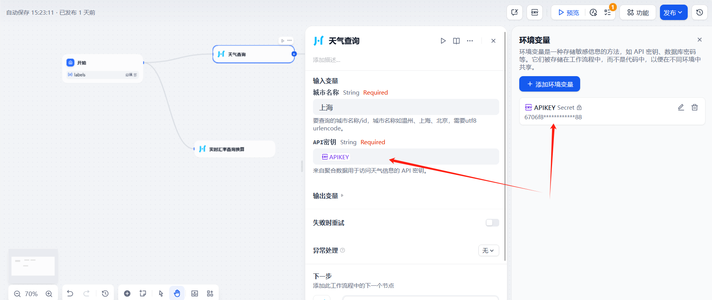

## Juhe Data API Plugin

**Author:** [leslie2046](https://github.com/leslie2046)
**Version:** 0.0.1
**Type:** Tool

### 🔍 Description

Access real-time **weather**, **currency exchange rates**, and **currency code lists** via the Juhe API.

> 📌 *Note: Some currency code queries may return no result depending on data availability.*

---

### ✅ Features

* **Weather** — Get weather info by city
* **Exchange** — Convert between two currencies
* **Currency List** — View common currency codes

---

### 🛠️ Setup

1. Register at [Juhe.cn](https://www.juhe.cn/)
2. Get your API Key:

   * Visit [我的API](https://dashboard.juhe.cn/data/index/my)
   
   * Click "申请新数据" → Select "天气预报"
   
   * Copy the generated API Key
   

---

### 🚀 Example Usage

#### 📍 Weather

```json
{
  "reason": "Query successful!",
  "result": {
    "city": "Shanghai",
    "realtime": {
      "temperature": "24",
      "humidity": "38",
      "info": "Cloudy",
      "direct": "Southeast wind",
      "power": "Level 2"
    }
  },
  "error_code": 0
}
```

#### 💱 Exchange Rate

```json
{
  "reason": "Query successful!",
  "result": [
    {
      "currencyF": "USD",
      "currencyT": "CNY",
      "exchange": "7.2374"
    }
  ],
  "error_code": 0
}
```

#### 💹 Currency List

```json
{
  "reason": "Query successful",
  "result": {
    "list": [
      { "name": "US Dollar", "code": "USD" },
      { "name": "Chinese Yuan", "code": "CNY" },
      ...
    ]
  },
  "error_code": 0
}
```

---

### 🐞 Issues & Feedback

* [Open an Issue](https://github.com/leslie2046/dify-plugin-juhe/issues)
* Include error messages and steps to reproduce
* ⚠️ Please **don’t** submit plugin issues to the main [Dify](https://github.com/langgenius/dify) repo

---

### 📄 License

[MIT](./LICENSE)

